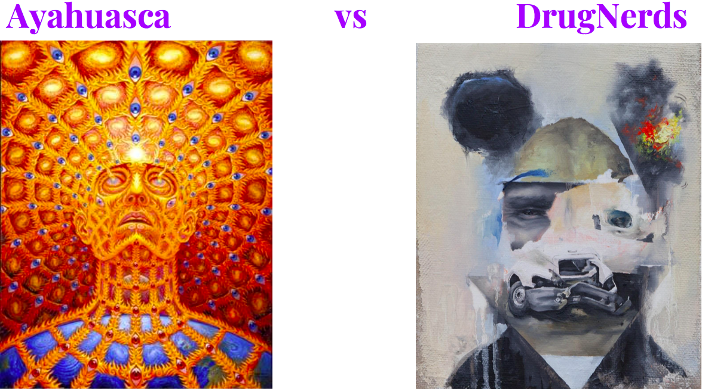

## Problem Statement
Collect posts from 2 subreddits from www.reddit.com, DrugNerd and Ayahuasca, using Reddit's API. Train the classifier on which subreddit a given post came from using NLP. The accuracy will tell if people consider Ayahuasca as a sacred medicine or just a drug. If they talking about Ayahuasca differently then about any other drugs.

## The data.
I used Reddit's API to collect data from DrugNerd and Ayahuasca subreddits. The API returns data in a .json format, so I can process the data in Python. 

## Executive Summary

Two categories 'DrugNerd' and 'Ayahuasca' are divided with very high accuracy. Among all the methods, logistic regression gave the highest accuracy of 97%. That shows what people think and say about ayahuasca, definitely separating it from the “drugs” category. People use more words like "experience", "ceremony", "retreat" and "help" when talking about Ayahuasca, which totally confirms my theory.